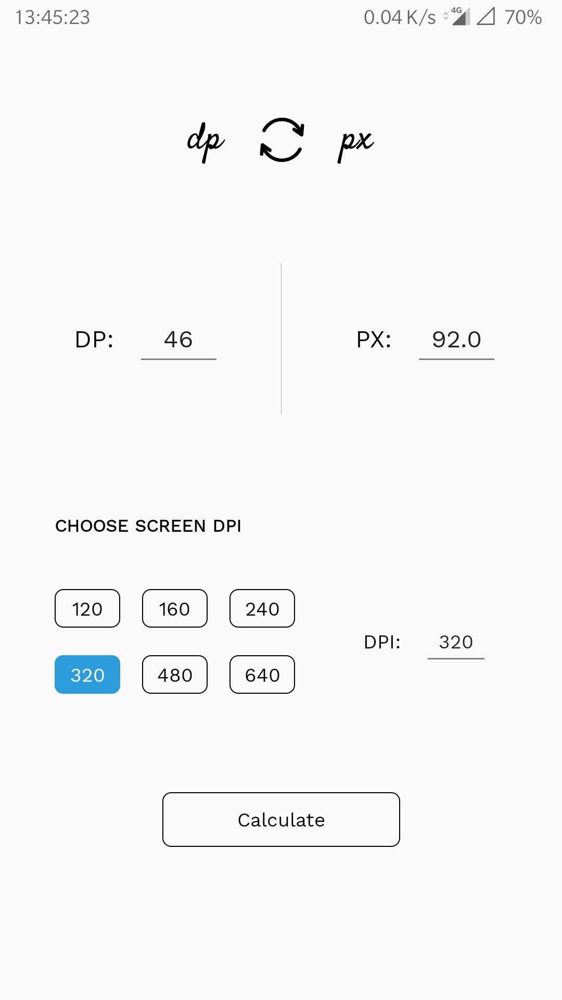
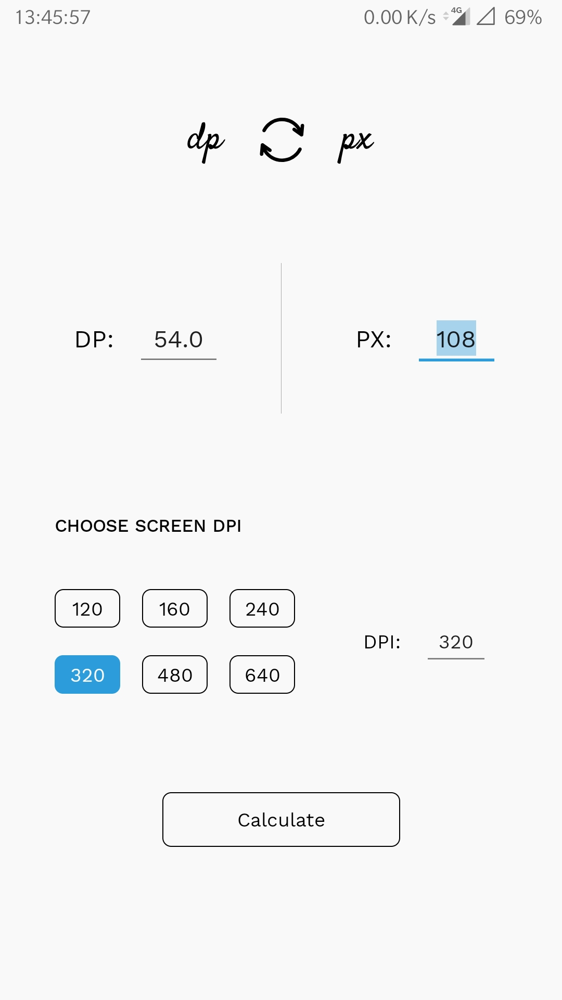

Dipsie Pixie 
============

##### _Intro_

This is a simple density-independent-pixel to pixel converter. 
One can also convert from pixel to dp :smile:

 &nbsp; &nbsp; 

##### _Backgroud_

- I've developed it to get hands-on with designing and implementing logic in Kotlin (I am new to it :feelsgood:)
- Demonstrated my custom  [ConstraintRadioGroup :link:](https://github.com/DaemonDhruv/ConstraintRadioGroup)

License
-------
    Creative Commons Legal Code
    CC0 1.0 Universal